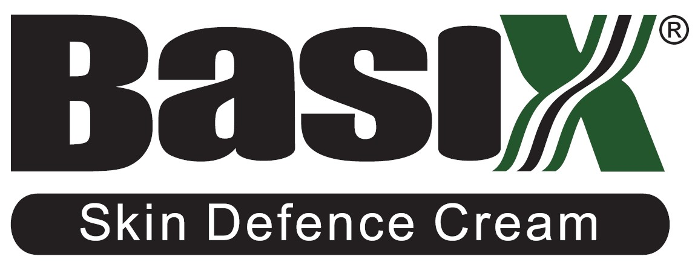

Welcome to the Basix website, the following ReadMe contains useful information pertaining to the website.

**Contents**
 - Decription
 - Wireframes
 - Final screenshots
 - Features
 - Testing
 - Deployment
 - Credits

------

## Gitpod Reminders

To run a frontend (HTML, CSS, Javascript only) application in Gitpod, in the terminal, type:

`python3 -m http.server`

------

## Description

User Story:  This site is aimed at people interested in natural skin care. Specifically a cream designed for dry skin conditions, a cream for dry feet, and a skin oil for helping to remove marks and scars.  This site displays 3 products on the home page, the customer can read about the products and can click through to purchase them on Amazon.co.uk where they can purchase the item.

------

## Wireframes

The site plan was created in Balsamiq at the inception of the project.  Screenshots as follows:

(add a screen shot)

------

## Final screenshots on various devices

Final screenshots created on https://ui.dev/amiresponsive as follows:

(add a screen shot)

------

## Features

- Header includes logo with link to home page, fixed to the top of the page, and appears on every page.
- Menu items highlight green when hovered over and underlines when on a page is selected / visited.
- Hero Image on each page has an overlay box, styled and positioned in the same place for consistency.
- Product section contains 3 images, consistently styled, with an overflow scrollbar where content is bigger than the container.  This content gives the visitor more information on the product.  
- Amazon Buy button with a working link to each product, styled like the Amazon buy button.  When hovering over the Buy Button, the button turns green matching the sites color scheme and signalling GO.
- Icons have been used to enhance the site design such as a leaf icon in place of bullets, and an envelope icon on the contact page.
- Footer is styled with the site’s color scheme, using clickable social media icons, separated by a horizontal line.
- About Page – styled to match the home page with hero image, features overlay box and paragraphs explaining About the people behind Basix and why this product has been chosen, which gives the visitor reassurance.
- Contact Page - styled to match the home page with the overlay box containing a nicely styled contact form with reset button allowing the visitor to get in touch
- Accessibility – throughout the site contrasting colors have been used.  The corporate green from the logo has been used for consistency, against a white background for ease of readability.  Photos have alt tags applied
- Features Ideas for the Future
1.  Styling of overflow scroll-bar to match the corporate green
2.  Animation of hero image
3.  Add a video testimonial page

------

## Testing

- Manual testing – all links, menu, logo, buy-buttons, contact form submit and reset and social icons are linked correctly and open in a new page.
- Screen size check – the site was checked for responsiveness using Chrome Dev Tools

**Bugs resolved:**

- Hero image overflow: hidden did not work.  Resolved with setting z-index.
- Menu did not center to 1500px when screen size is wider than 1500px – resolved with applying max-width, margin and float to body section.
- All product images did not center on responsive wide – resolved by adding display: flex to image-container, adjusted image scale to 90%.
- Tissue Oil Div did not align with Kigelia and Foot food when stacked – resolved by changing media query for individual products sections to display: inline-block.
- Footer width of 1500px does not align with hero image of 1500px – resolved by changing hr width to 100%.

**Unresolved bugs:**

- There are no unresolved bugs

**Validator testing**

- W3C HTML Validator: 
- W3C CSS Validator (Jigsaw):
- Accessibility
- Colors and fonts chosen are accessible - checked via Lighthouse in chrome dev tools 

(add a screen shot)

------

## Deployment

The following steps were taken to deploy the site:

1. (add steps)
2. (add steps)
3. (add steps)

------

## Credits

- Code used for footer section borrowed and modified from Code Institute Love Running project
- Code used for overlay text section borrowed and modified from Code Institute Love Running project
- Media Images credits: 
1. Hero image - Photo by Katherine Hanlon on Unsplash, and Photo by David Marcu on Unsplash
2. Google Fonts - Roboto
3. FontAwesome icons - Leaf icon by Fontawesome - https://fontawesome.com/icons/leaf-heart?s=thin&f=classic
4. Social icons made by Pixel perfect from www.flaticon.com
- Content & Images owned by Lombardi & Smith Limited, www.lombardismith.com, (Director: Russell Smith)

------
